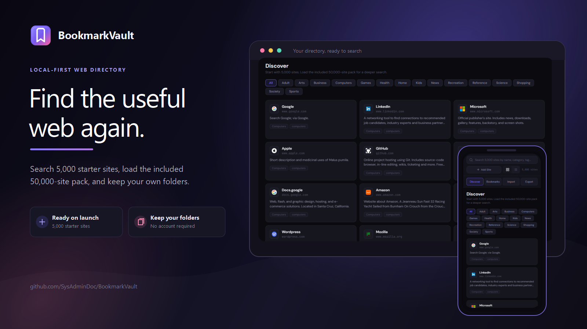
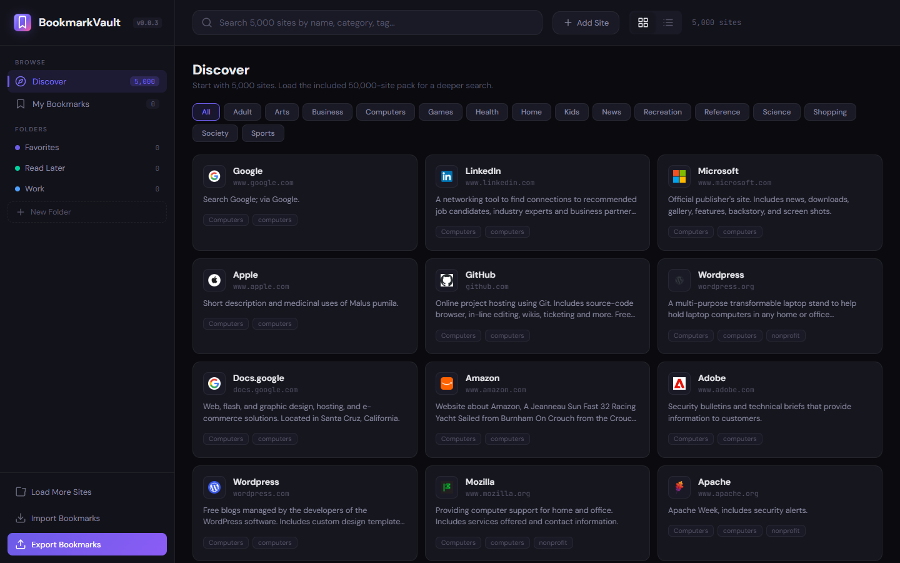
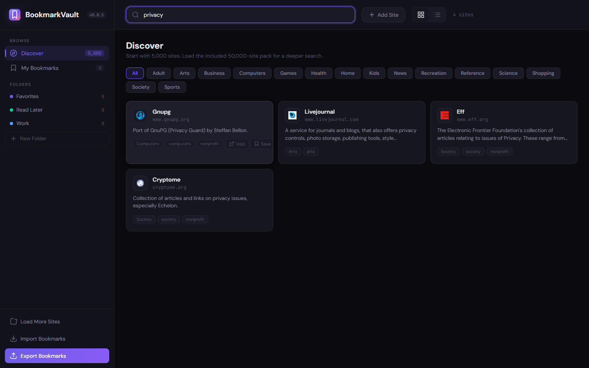
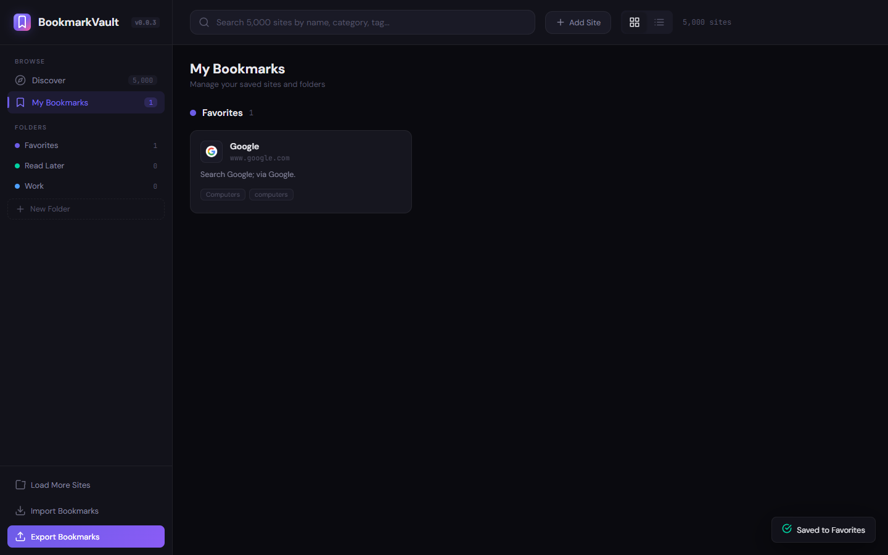
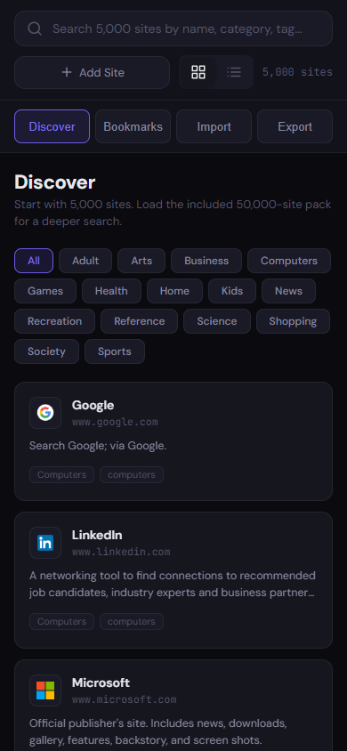

# BookmarkVault


<p align="center">
  <a href="https://ko-fi.com/X8K126YVER">
    
  </a>
</p>

<p align="center">
  <sub><em>If this project helps you, a coffee helps me keep working on it.</em></sub>
</p>

BookmarkVault is a local-first web directory that runs from one HTML page. Search the 5,000-site starter catalog, load the included 50,000-site pack when you want broader results, then save useful sites into folders stored by your browser.

[Open the live app](https://sysadmindoc.github.io/BookmarkVault/) · [Download the latest release](https://github.com/SysAdminDoc/BookmarkVault/releases/latest)

## See it in action

| Explore the starter directory | Search across names, categories, and tags |
| --- | --- |
|  |  |

| Keep personal folders in the browser | Use the same core tools on a phone |
| --- | --- |
|  |  |

## What it does

- Searches the embedded 5,000-site directory without a database or account.
- Loads the included 50,000-site compact pack through the **Load More Sites** action.
- Saves folders, bookmarks, and custom sites in browser local storage.
- Imports and exports standard browser bookmark HTML files.
- Opens destination sites in a new tab while BookmarkVault stays available.

## Quick start

Use the [hosted app](https://sysadmindoc.github.io/BookmarkVault/), or download the latest release and open `index.html`.

For local development, serve the repository so browser file restrictions don't get in the way:

```powershell
git clone https://github.com/SysAdminDoc/BookmarkVault.git
cd BookmarkVault
python -m http.server 8765 --bind 127.0.0.1
```

Then open `http://127.0.0.1:8765`.

## Catalog sizes

| Catalog | What ships | How it is used |
| --- | ---: | --- |
| Starter directory | 5,000 sites | Embedded in `index.html` and ready on launch |
| Expanded directory | 50,000 sites | Included in `data/bookmarkvault_50k_sites.json` and loaded on demand |
| Source catalog statistics | 959,115 domains | Recorded in `data/bookmarkvault_stats.json`; this full catalog is not bundled |

## Privacy and data notes

Your folders and saved sites stay in the current browser profile under the `bv2_state` local storage key. There is no sign-in or sync service.

The directory descriptions come from historical DMOZ-derived data. Some entries are stale or don't accurately describe the current site. The catalog also contains an Adult category and should not be treated as a filtered family directory.

BookmarkVault requests Google Fonts and site icons from Google's favicon service. Following a **Visit** link leaves the app and is subject to the destination site's own policies.

## Project layout

- `index.html` contains the application and starter catalog.
- `data/` holds the optional compact pack and source statistics.
- `assets/` holds the logo and README artwork.
- `docs/screenshots/` contains current product captures.

## License

BookmarkVault is available under the [MIT License](LICENSE).
